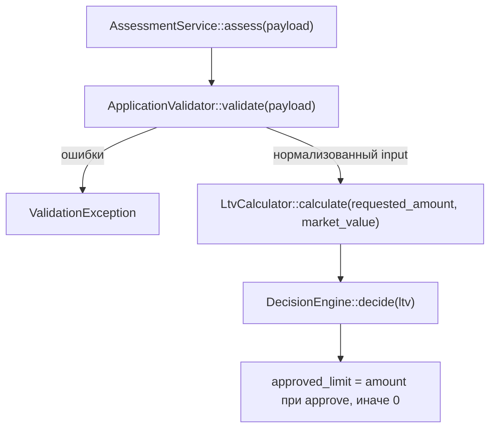

## Участующие файлы и порядок вызова

Точка входа — `AssessmentService::assess()` (`backend/src/Domain/AssessmentService.php`), конвейер описан прямо в её докблоке: *валидация → LTV → решение → лимит*:

По шагам:

1. **`ApplicationValidator::validate($payload)`** (`ApplicationValidator.php:24`) — валидирует и нормализует заявку по порогам из `backend/config/rules.php`. Внутри последовательно вызывает `VinValidator::isValid()` для VIN, `VehicleAge::inYears()` для года, и по числам из `rules['vehicle']`, `rules['amount']`, `rules['term']` проверяет год, пробег, стоимость, сумму и срок. Любые ошибки — `ValidationException`, нормализованный массив `{vin, year, mileage, market_value, requested_amount, term_months}` возвращается дальше.
2. **`LtvCalculator::calculate($input['requested_amount'], $input['market_value'])`** (`LtvCalculator.php:15`) — LTV в процентах с двумя знаками: `round(requestedAmount / marketValue * 100, 2)`.
3. **`DecisionEngine::decide($ltv)`** (`DecisionEngine.php:30`) — единственное место, где рождается решение. Пороги `approve_max` (60.0) и `review_max` (85.0) передаются в конструктор из `rules['ltv']`. Логика: `LTV < 60` → `APPROVE`; `LTV <= 85` → `REVIEW`; иначе → `REJECT`.
4. **Результат** собирается в `assess()`: `vehicle_age` (через `VehicleAge::inYears`), `ltv`, `decision`, `approved_limit` (равен запрошенной сумме при approve, иначе 0).

`VinValidator`, `VehicleAge`, `ValidationException` — вспомогательные; в решение approve/review/reject напрямую вклада не имеют (VehicleAge влияет только на то, пройдёт ли заявка валидацию года).

## Куда встанет правило «пробег >= 400 000 км → review»

**Функция:** `DecisionEngine::decide()` — это единственное место в коде, где выбирается `approve`/`review`/`reject`. Конкретно — перед или после существующих проверок LTV (например, первой проверкой: `если mileage >= 400000 → return self::REVIEW`; граница строгая по решению заказчика 2026-09-27 — ровно 400 000 уже переводится в `review`). Итоговое решение плана (docs/plan/plan_MILEAGE.md, шаг 4) — пост-обработка в `AssessmentService::assess()` с сохранением контракта `DecisionEngine`; этот вариант выбран вместо расширения `decide()`.

**Что для этого уже есть:**
- Само значение пробега: `ApplicationValidator` валидирует его и возвращает в `input['mileage']`, и `AssessmentService::assess()` имеет доступ к `$input['mileage']` — данные уже доходят до уровня, где вызывается `decide()`.
- Паттерн выноса чисел в `rules.php` (по конвенции пороги не хардкодятся) — место для нового ключа вроде `vehicle.max_mileage_review_km` в конфиге есть структурно, но самого ключа **нет**.

**Чего не хватает:**
- `DecisionEngine::decide()` принимает только `float $ltv` — пробег в него **не передаётся**. Нужно расширить сигнатуру `decide()` (и/или конструктор `DecisionEngine`, который сейчас получает только `ltv`-пороги) и передать `$input['mileage']` из `assess()`.
- Порога 400 000 в `rules.php` **нет** — есть только `vehicle.max_mileage_km = 500000`, и это порог валидации, а не решения.

## Что сейчас проверяется про пробег

Ровно одна проверка — `ApplicationValidator::validate()`, строки 43–46: `$mileage = (int)($payload['mileage'] ?? -1);` и `если mileage < 0 или mileage > rules['vehicle']['max_mileage_km'] (500000)` → ошибка «Пробег от 0 до %d км» в `ValidationException`. То есть сейчас пробег выше 500 000 км заявку целиком **отклоняет на валидации**, а в диапазоне 0–500 000 км на решение никак не влияет.

В `DecisionEngine`, `LtvCalculator`, `AssessmentService`, `VehicleAge`, `VinValidator` пробег **не используется** — нет. Других проверок пробега (правдоподобность, связь с возрастом и т.п.) в коде **нет**.